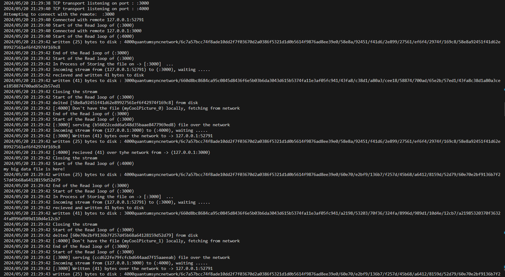

# QuantumSync


Welcome to QuantumSync, where your data storage takes a _quantum leap forward!_ <br />
* This repo implements a peer-to-peer communication system over a TCP network, offering a robust and decentralized solution for file storage that’s sure to entangle your interest. 
* QuantumSync allows you to upload files to the network effortlessly, fetch files from your local disk, and if they aren't available locally, the system will retrieve them from other peers faster than you can say _beam me up_. 
* You can also delete files across the network with the ease of flipping a _quantum switch_. For enhanced data protection and privacy, all data is stored in encrypted form across the peers, effectively making it your very own _data cloaking device_. 
* The folder system is managed by a Content Addressable System (CAS), where keys are also encrypted, _adding layers of shields for data protection_. QuantumSync ensures your data isn't just secure—it's _quantum secure_, providing you with a storage solution that operates with the _speed of light_ and the security of a fortified vault.<br> 
#### Get ready to store your data with QuantumSync and experience a storage solution that's out of this world!

### Note
There are some key terms that we will be using in this repo:
* ``key``: key is a string which determines the folder structure or where the data will be stored. It is first passed into ``CASPathTransformFunc()`` function which could be found in ``store.go``, and is then encrypted via ``hashKey()`` function which could be found in ``crypto.go``. 
* ``peer``: A peer refers to any device or node that participates in a network. In a peer-to-peer (P2P) network, each node acts both as a client and a server, offering resources to other nodes while also requesting resources from them.  

## Operations Supported 
Here are some of the operations supported by _QuantumSync_.
#### Creating a server
```go
    server := makeServer(":4000", ":3000")
```
The first arg of makeServer() is the listenAddress to which the server will be listening, and the second arg is ``Vardiac`` containg list of listenAddress of it's peers.

#### Starting/Bootstrapping the server
``` go
    server.Start()
```
``Start()`` starts and bootstraps the server, making it available for incoming connections and sharing data. 

#### Storing data on the server
``` go
    server.Store(key, data)
```
The ``Store()`` takes two arguments, ``key`` which decides where the file would be stored and ``data`` what needs to be stored.

#### Get the file from server
``` go
    server.Get(key)
```
The ``Get()`` takes ``key`` and first searches the file on local disk, if present it will return the file, if not found it will broadcast over all it's ``peers`` asking for the file and if present will fetch it over the network.

#### Deleting the data 
``` go
    server.Delete(key)
```
The ``Delete()`` takes a single argument which is ``key``, and deletes the file

#### Clear the whole server
``` go
    server.Clear()
```
The Clear() deletes all the files present on the server. 

## Example Usage
```go 
    // Create as many servers, for simplicity we are creating two. 
    s1 := makeServer(":3000", "")
	s2 := makeServer(":4000", ":3000") //s2 is the main server and s1 is it's peer.
	go func() {
		s1.Start() // Starting s1 server
	}()
	time.Sleep(2 * time.Second)
	go s2.Start() // Starting s2 server
	time.Sleep(2 * time.Second) 

	for c := 0; c < 20; c++ {
		key := fmt.Sprintf("myCoolPicture_%d", c)
		data := bytes.NewReader([]byte("my big data file is here!"))
        // Storing the data on local machine and also storing on remote peers.
		s2.Store(key, data)

        // Deleting the data on local machine.
		if err := s2.store.Delete(key); err != nil {
			log.Fatal(err)
		}
         
        // Fetching the file based on the key, since for this key the file has
        // been deleted on local disk, fetching the file from it's peers. 
		r, err := s2.Get(key)
		if err != nil {
			log.Fatal(err)
		}
		b, err := ioutil.ReadAll(r)
		if err != nil {
			log.Fatal(err)
		}
            fmt.Println(string(b))
	}
```
## Directory/File Structure
 Here's a brief overview of the project's 
 * ``p2p/``: Contains the peer-to-peer library implementation, for communicating and sharing files. 
 * ``crypto.go``: Contains the functions responsible for encryption and decryption of data. 
 * ``server.go``: Contains all the tasks performed by server, including the one's discussed above. 
 * ``store.go``: Responsible for reading and writting the data on/from the disk. 
 * ``(3000/4000)/quantumsyncnetwork/``: The number in front(3000/4000) denotes the listening address of the server,and after quantumsyncnetwork it represents the folders, files and data stored in encrypted/decrypted form on that server.   

 ## OUTPUT
 Here is a screenshot of how the servers are working, writing, reading, storing and streaming files over the network. The following is the output for ``main.go``

 